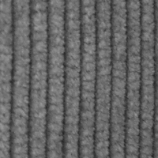
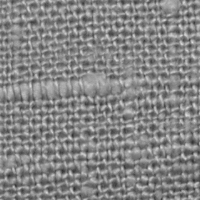
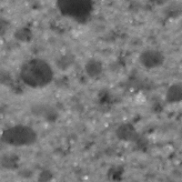
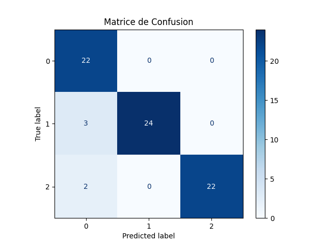

# Classification de textures avec GLCM et SVM

## 1. Description du projet

Ce projet a pour objectif de classifier automatiquement des images de textures en trois classes : corduroy, linen et sponge.
Pour cela, nous utilisons :

* GLCM (Gray Level Co-occurrence Matrix) pour extraire les caractéristiques de texture.

* SVM (Support Vector Machine) pour classifier les images selon leurs textures.

Applications possibles : inspection industrielle, imagerie médicale, reconnaissance de motifs, etc.

## 2. Structure du projet

* dataset/ : contient les images pour les trois classes. 
* main.py : script principal pour charger les images, extraire les features, entraîner le modèle et évaluer la performance. 
* feature_extraction.py : fonctions pour extraire les caractéristiques GLCM. 
* classifier.py : fonctions pour entraîner et utiliser le SVM.

## 3. Prérequis

version : **Python 3.10.7**

**Bibliothèques Python :**

* numpy 
* opencv-python 
* scikit-image 
* scikit-learn

**Installation rapide :**

**`pip install numpy opencv-python scikit-image scikit-learn`**

## 4. Exécution

Pour lancer le projet :

`python main.py`

Le script fait :

4.1. Lecture des images depuis dataset/. 

4.2. Conversion en niveaux de gris. 

4.3. Extraction des caractéristiques GLCM.

4.4. Séparation des données en train/test.

4.5. Entraînement du modèle SVM.:

4.6. Prédiction sur le jeu de test.

4.7. Affichage de la précision et de la matrice de confusion.

## 5. Résultats

Précision obtenue :  93.15%

La matrice de confusion montre comment chaque classe a été prédite :

**sponge ,linen ,corduroy**

## 6. Améliorations futures :

Ajouter plus d’images pour chaque classe (dataset plus large).

Extraire davantage de caractéristiques de texture.

Tester des modèles de deep learning pour améliorer la précision.

## 7. Captures d’écran:

### Exemple d’image de chaque classe:

corduroy :

linen : 

sponge :

Matrice de confusion finale:

